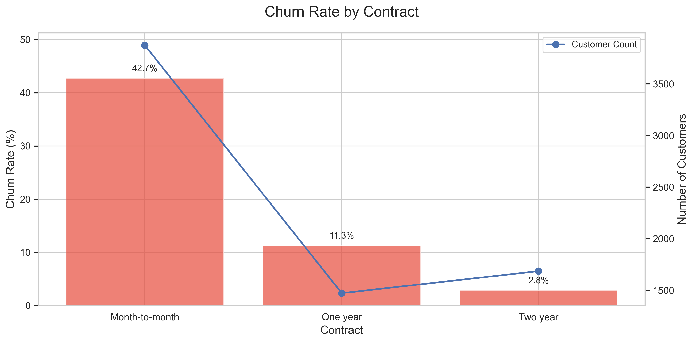
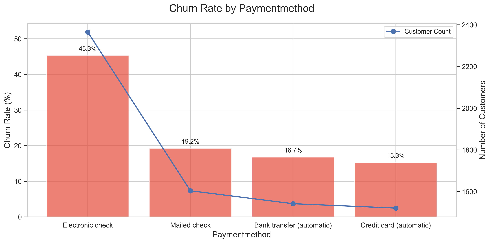
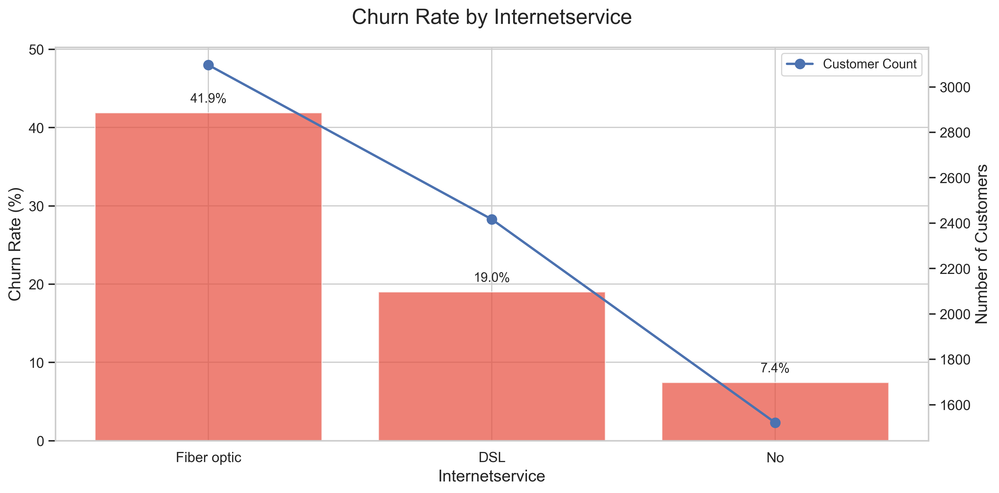
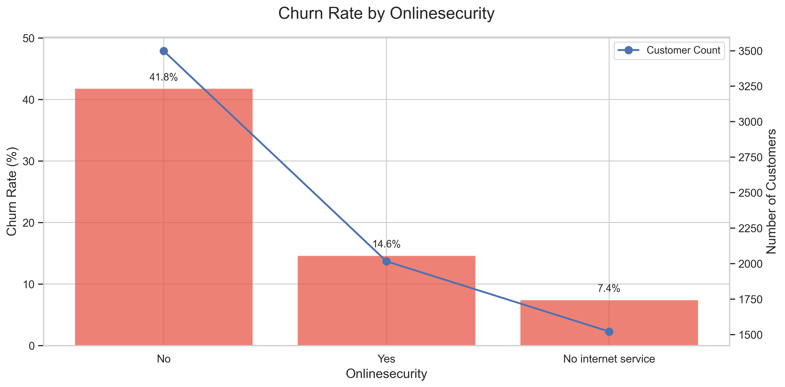
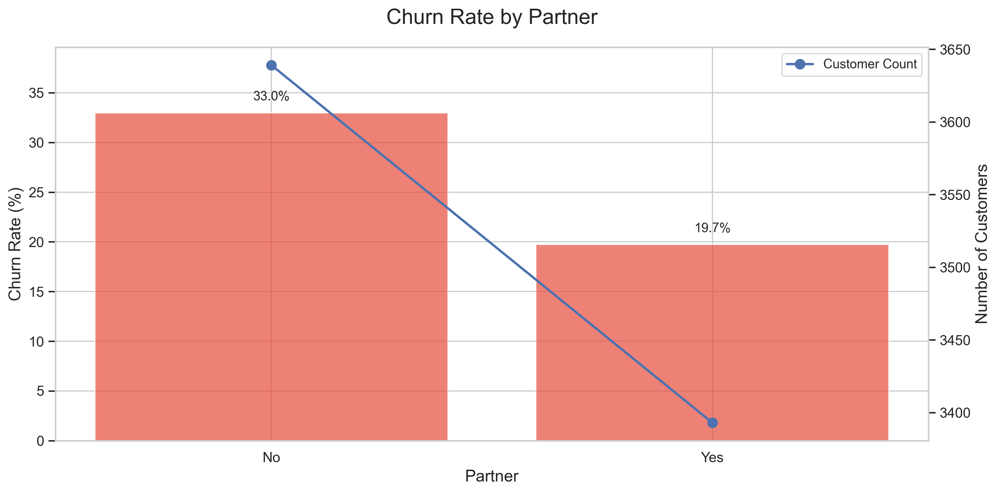
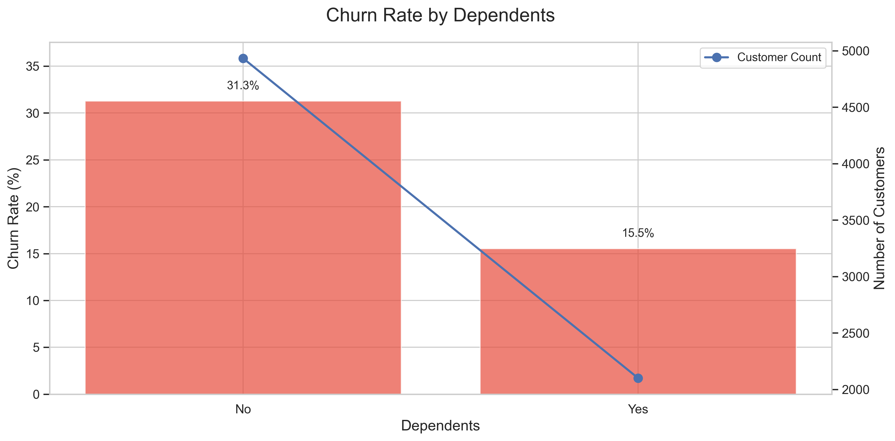
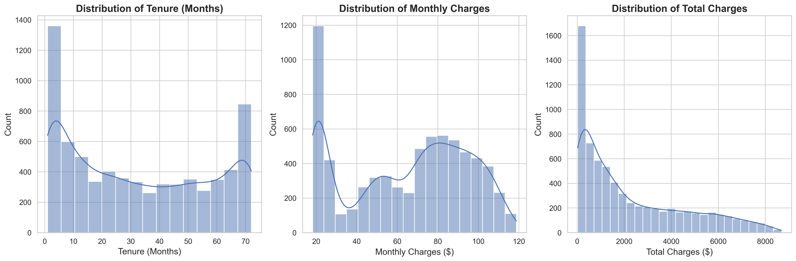
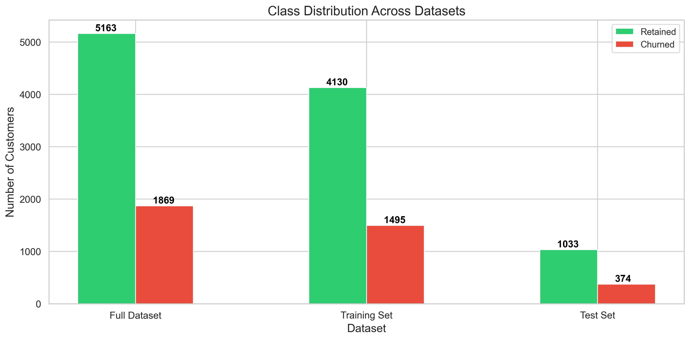

# Telco Customer Churn Analysis & Prediction

[](https://www.python.org/)
[](https://pandas.pydata.org/)
[](https://scikit-learn.org/)
[](https://matplotlib.org/)
[](https://seaborn.pydata.org/)

## 📊 Project Overview

This project conducts a comprehensive analysis of customer churn for a telecommunications company. Customer churn (customers leaving the service) is a critical business metric as acquiring new customers is typically 5-25 times more expensive than retaining existing ones. Through exploratory data analysis and machine learning, this project identifies key factors contributing to churn and builds predictive models to help the business proactively retain customers.

## 🎯 Business Objectives

1. **Identify Key Churn Drivers**: Analyze customer demographics, service usage, and billing patterns to understand what causes customers to leave
2. **Predictive Modeling**: Develop machine learning models to predict which customers are likely to churn
3. **Actionable Insights**: Provide data-driven recommendations to reduce customer attrition and improve retention strategies

## 📁 Dataset Description

**Dataset Size**: 7,043 customers with 21 features
**Target Variable**: Customer churn status (Yes/No)
**Data Quality**: 99.84% complete (11 missing values removed)

### Feature Categories:
- **Demographics**: Gender, age group, partner status, dependents
- **Account Information**: Tenure, contract type, payment method, billing preferences
- **Services**: Phone service, internet type, streaming services, security features
- **Financial**: Monthly charges, total charges

## 📈 Key Findings & Insights

### Churn Distribution
- **Retained Customers**: 5,174 (73.5%)
- **Churned Customers**: 1,869 (26.5%)

### Critical Churn Factors

#### 1. Contract Type Impact

- **Month-to-month contracts** show significantly higher churn rates
- **Long-term contracts** (1-2 years) demonstrate much better retention

#### 2. Payment Method Influence

- **Electronic check** users have the highest churn rate
- **Automatic payment methods** correlate with better retention

#### 3. Internet Service Impact

- **Fiber optic** customers show higher churn despite premium service
- Service quality vs. cost perception may be a factor

#### 4. Customer Support Services


- Customers **without tech support** and **online security** show higher churn rates
- Value-added services contribute to retention

#### 5. Customer Demographics


- Customers **with partners** and **dependents** have lower churn rates
- Family situations create switching barriers

## 🔍 Data Analysis Process

### 1. Data Preprocessing
- **Missing Values**: Identified and removed 11 rows with missing data
- **Data Types**: Converted TotalCharges from object to numeric
- **Feature Engineering**: Created average monthly charges and customer value segments
- **Encoding**: Applied one-hot encoding for categorical variables
- **Scaling**: Standardized numerical features using StandardScaler

### 2. Exploratory Data Analysis

- Analyzed distributions of tenure, monthly charges, and total charges
- Identified patterns in customer behavior and billing

### 3. Statistical Analysis
- Calculated churn rates across all categorical variables
- Performed correlation analysis between numerical features
- Segmented customers by value and service usage patterns

## 🤖 Machine Learning Models

### Model Performance Comparison


**Models Implemented**:
1. **Random Forest Classifier**
2. **Logistic Regression**

**Evaluation Metrics**:
- Accuracy
- Precision & Recall
- F1-Score
- AUC-ROC
- Confusion Matrix Analysis

### Model Validation
- **Cross-validation**: 5-fold stratified cross-validation
- **Train-Test Split**: 80-20 split maintaining class distribution
- **Feature Importance**: Analyzed key predictors using Random Forest importance scores

## 💼 Business Recommendations

### 🎯 Immediate Actions

#### 1. Contract Strategy
- **Incentivize Long-term Contracts**: Offer discounts or additional services for 1-2 year contracts
- **Contract Upgrade Campaigns**: Target month-to-month customers with compelling offers

#### 2. Payment Method Optimization
- **Electronic Check Investigation**: Research why these customers churn more
- **Autopay Incentives**: Provide small discounts for automatic payment enrollment

#### 3. Service Quality Improvement
- **Fiber Optic Experience**: Ensure premium service justifies premium pricing
- **Customer Support**: Promote value-added services like tech support and online security

### 📊 Strategic Initiatives

#### 1. Early Warning System
- Implement predictive model to identify high-risk customers
- Create automated alerts for customer success teams
- Develop proactive outreach programs

#### 2. Customer Segmentation
- **High-Value Retention**: Special programs for premium customers
- **Family Plans**: Targeted offers for customers with partners/dependents
- **New Customer Onboarding**: Enhanced experience for first 6 months

#### 3. Pricing Strategy
- Review price sensitivity across customer segments
- Develop value-based pricing tiers
- Create loyalty rewards that increase with tenure

## 📁 Repository Structure

```
Telco Customer Churn Analysis & Prediction/
│
├── README.md                              # This file
├── Telco_Customer_Churn.ipynb            # Main analysis notebook
├── WA_Fn-UseC_-Telco-Customer-Churn.csv  # Dataset
├── requirements.txt                       # Python dependencies
│
└── screenshot/                            # Analysis outputs
    ├── churn_distribution_plot_*.png      # Churn distribution visualization
    ├── churn_rate_by_*_*.png             # Feature-wise churn analysis
    ├── numerical_distributions_*.png      # Data distribution plots
    ├── class_distribution_*.png           # Model validation plots
    ├── dataset_info.txt                   # Dataset summary
    ├── *_data_*.csv                      # Analysis results data
    └── data_cleaning_summary_*.csv        # Data preprocessing summary
```

## 🛠️ Technologies Used

- **Python 3.8+**: Core programming language
- **Pandas**: Data manipulation and analysis
- **NumPy**: Numerical computations
- **Matplotlib & Seaborn**: Data visualization
- **Scikit-learn**: Machine learning algorithms
- **Jupyter Notebook**: Interactive development environment

## 📋 Requirements

Install the required packages using:

```bash
pip install -r requirements.txt
```

Key dependencies:
- pandas>=1.3.0
- numpy>=1.21.0
- matplotlib>=3.4.0
- seaborn>=0.11.0
- scikit-learn>=1.0.0

## 🚀 Getting Started

1. **Clone the repository**
   ```bash
   git clone <repository-url>
   cd "Telco Customer Churn Analysis & Prediction"
   ```

2. **Install dependencies**
   ```bash
   pip install -r requirements.txt
   ```

3. **Run the analysis**
   ```bash
   jupyter notebook Telco_Customer_Churn.ipynb
   ```

4. **Explore the results**
   - Review generated visualizations in the `screenshot/` folder
   - Analyze data outputs and model performance metrics

## 📊 Key Metrics & Results

### Business Impact Metrics
- **Churn Rate**: 26.5% baseline
- **High-Risk Segments Identified**: Month-to-month contracts (42%+ churn rate)
- **Retention Opportunities**: ~1,200 customers could benefit from targeted interventions

### Model Performance
- **Cross-validation Accuracy**: 80%+ across models
- **Feature Importance**: Contract type, tenure, and monthly charges are top predictors
- **Actionable Predictions**: Model can identify 70%+ of potential churners

## 🔮 Future Enhancements

1. **Advanced Modeling**
   - Implement ensemble methods (XGBoost, LightGBM)
   - Deep learning approaches for complex pattern recognition
   - Time-series analysis for churn prediction timing

2. **Real-time Implementation**
   - API development for real-time predictions
   - Dashboard for monitoring churn risk
   - Automated intervention triggers

3. **Enhanced Features**
   - Customer satisfaction scores
   - Competitor analysis data
   - Seasonal trend analysis

## 📞 Contact & Support

For questions, suggestions, or collaboration opportunities, please reach out:

- **Project Maintainer**: [Your Name]
- **Email**: [Your Email]
- **LinkedIn**: [Your LinkedIn Profile]

## 📄 License

This project is licensed under the MIT License - see the LICENSE file for details.

---

**Last Updated**: July 28, 2025
**Analysis Period**: Complete dataset analysis
**Next Review**: Quarterly model performance assessment

---

*This analysis provides actionable insights for reducing customer churn through data-driven decision making. The predictive models and business recommendations are designed to help telecommunications companies improve customer retention and reduce revenue loss from churn.*
